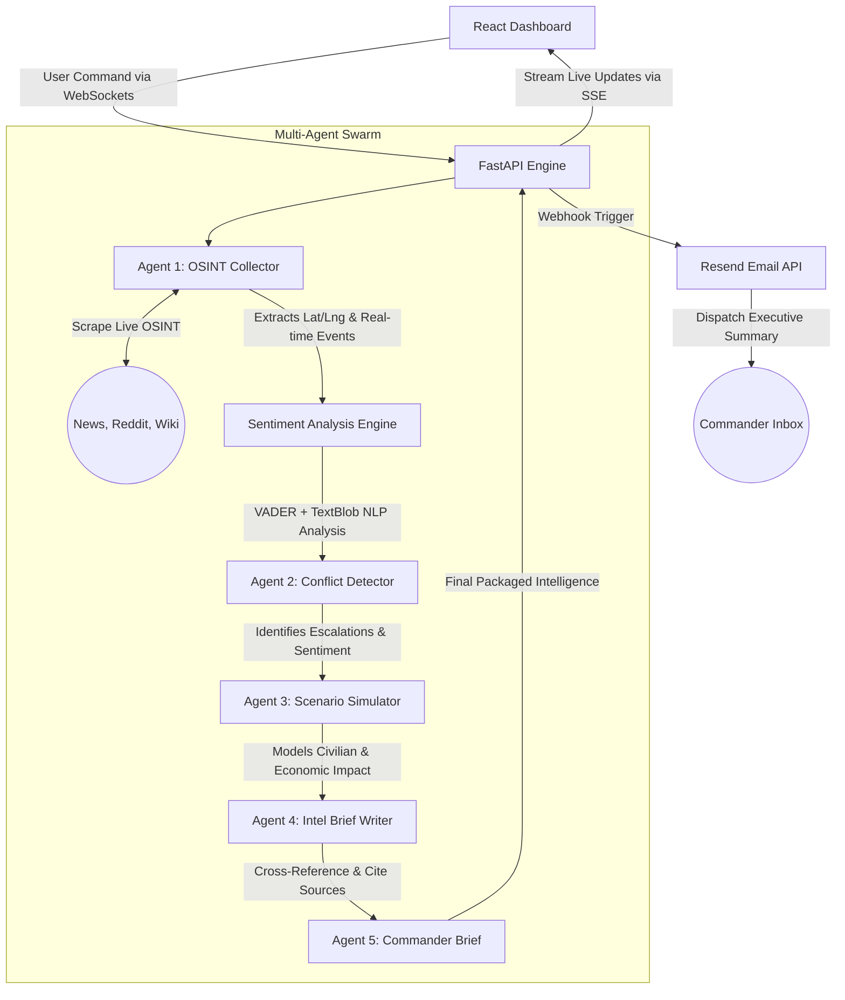
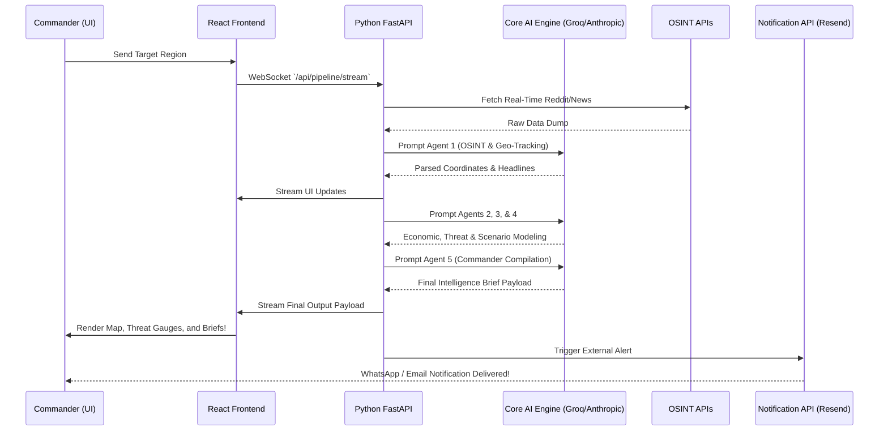

# Conflict.AI — Autonomous Intelligence & Prediction System

Conflict.AI is a powerful, real-time autonomous reconnaissance and intelligence-gathering platform designed to ingest scattered Open-Source Intelligence (OSINT) and synthesize it into actionable military/commander-grade briefs within seconds. It utilizes a sophisticated Multi-AI Agent pipeline running on a Python backend, with an interactive React dashboard visualizing everything from Live Global Threats to Macro-Economic consequences.

## System Flow & Architecture

Conflict.AI has evolved from a monolithic application into a powerful dual-stack system featuring a FastAPI Python Backend controlling a swarm of AI agents, and a React + Vite frontend for beautiful analytical UX.

### Multi-AI Agent Pipeline

### End-to-End System Flow

## Key Features

* **🌍 Live OSINT Geo-Tracking Map:** Automatically extracts Lat/Long coordinates from raw news text and plots them directly on an interactive OpenStreetMap layer directly within the central dashboard. 
* **🤖 5-Stage Multi-Agent AI Swarm:** The system breaks tasks down into specialized LLM agents (OSINT Collector, Conflict Analyst, Scenario Designer, Humanitarian Analyst, and Commander).
* **📊 Real-Time Sentiment Analysis Engine:** Lightweight NLP-powered sentiment analysis using VADER and TextBlob libraries. Analyzes conflict-specific terminology with custom keyword modifiers, providing real-time sentiment scores streamed via SSE to the frontend.
* **📨 Automated Dispatch System:** Hooked deeply into the Back-End; as soon as an intelligence brief wraps up, the platform immediately pushes the executive summary alert to commanders' Email inboxes using the Resend API.
* **📉 Macro-Economic Simulation:** Specifically targets stock market volatility indicators and commodity vulnerabilities related directly to detected conflicts, expanding beyond just civilian impact modeling.
* **🖨️ Printable Intelligence Flow:** Exports cleanly parsed Commander Tactical briefs directly to PDF format natively from the UI.
* **🌙 Dynamic Light/Dark Modes:** Beautiful, hardware-accelerated glassy panels and thematic control.

## Setup & Installation

### Backend (Python / FastAPI)
1. Navigate into `backend/`.
2. Install pip dependencies: `pip install -r requirements.txt`.
   * Required: `fastapi`, `uvicorn`, `groq`, `anthropic`, `resend`, `python-dotenv`
   * For Sentiment Analysis: `vaderSentiment`, `textblob`
3. Create a `.env` in the root and add your keys:
   * `VITE_GROQ_API_KEY` or `VITE_ANTHROPIC_API_KEY`
   * `RESEND_API_KEY` (Optional for email automations)
4. Start the server: `python main.py`

### Frontend (React / Vite)
1. Intall node packages: `npm install`
2. Start the dev server: `npm run dev`
3. Hit the UI in your browser (`http://localhost:5173`).
